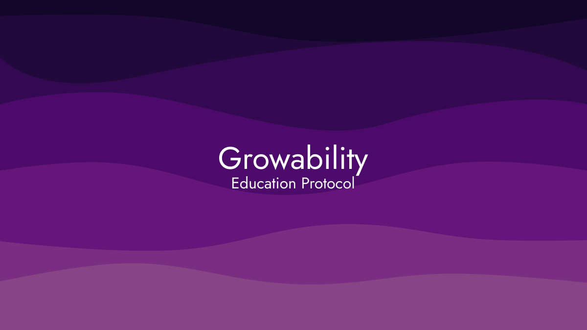

- [Education Protocol](#education-protocol)
  - [Overview of Education Protocol](#overview-of-education-protocol)
  - [How this works?](#how-this-works)
    - [Education Profile](#education-profile)
    - [Education Organization (Knowledge Provider)](#education-organization-knowledge-provider)
    - [Education Certificates](#education-certificates)
    - [Education Protocol Role](#education-protocol-role)
  - [Development Roadmap](#development-roadmap)

# Education Protocol

> **Warning!** The current version of the Education Protocol is undergoing a **security audit**. We do not recommend using it in production environments.
>
> The source code is provided here for informational purposes only.

## Overview of Education Protocol

The Education Protocol is a decentralized system for storing educational certificates using smart contracts. It is designed for easy integration with any knowledge dissemination platform.

## How this works?

### Education Profile

Education Protocol provide unique NFT profile to user that will keep all information about knowledge that user got.

We use on-chain verification with WorldID to determine the uniqueness of the user. Therefore, one user can only create a profile once.

This is a single profile for any course, educational program or other source of knowledge. All received certificates will be linked to your profile.

### Education Organization (Knowledge Provider)

Various entities can register as Education Organizations on the Education Protocol. Examples include:

- Blogs
- Chat groups in messengers
- Online course platforms
- Educational institutions
- AI-driven learning tools

To register, you must have a smart contract that will be used as an account for an educational organization and all management of the issuance of certificates will occur from the address of this smart contract.
We provide a basic smart contract that can be used to get started quickly. In addition, we will add the ability to quickly launch a project directly from our website.

In addition, after registration, the owner of the company will receive an Education Organization NFT at his address, which will provide him with access to the organization’s control panel on the project website.

### Education Certificates

Educational organizations may issue education certificates. Certificates of education are NFT compatible smart contracts that can be linked to the user’s profile.

All educational certificates are issued through and under contract with the organization. This allows organizations to maintain control over the certificates issued.

The issued certificates can be either general or contain notes on individual knowledge acquired.

### Education Protocol Role

The Education Protocol's role is to facilitate the issuance and management of educational certificates, ensuring standards are met and preventing fraud.

We provide:

- An SDK for seamless integration with websites or CRMs.
- Tools for student engagement and management.
- Systems for issuing, managing, and validating certificates.
- Opportunities for blockchain integration, analytics, and process automation.

## Development Roadmap

- [ ] Conduct additional testing.
- [ ] Complete the security audit.
